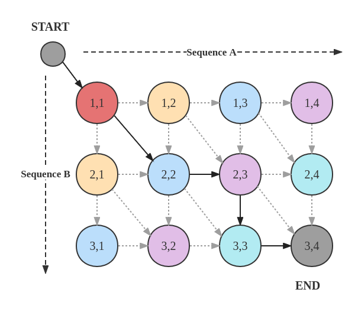
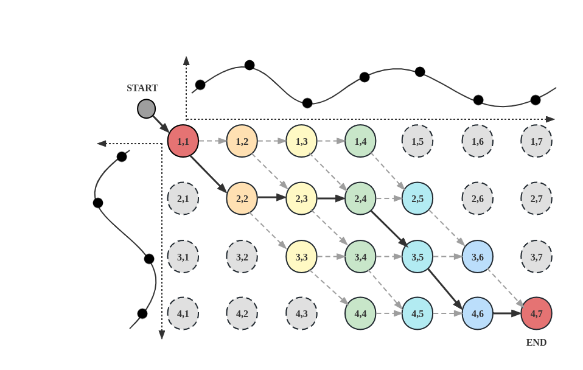

# Implementation of Latent Optimal Path by Gumbel Propagation for Variational Bayesian Dynamic Programming

## Example implementation of a general DAG 

The GeneralDAG folder gives example implimentation including any general 1D DAG, Time series alignment and monotonic alignment.

### sample.py:
Implementation of Bayesian Dynamic Programming on any general DAG given the distance matrix (W) and a temperature scalar $\alpha$.

The distance matrix should be a NxN matrix, which:
1. W[u,:] represents u's children v if W[u,v] $\neq -\infty$.
2. W[:,v] represents v's parent u if W[u,v] $\neq -\infty$.
	
The function compute the optimal path by argmax(W).
The compute complexity is $O(N)$ where N is the node size and all computations are based on numpy array.

### test.py

=======

Verify the correctness of sample.py by comparing with brue force method and argmin(-W), including:
1. Check cumulative probabilities.
2. Check sampling the optimal path by sampling 1000 times (gibbs & reversed ).
3. Check omega and expectation of the distribution (gibbs & brue force & reversed).

## Time series alignment 

The time_series_alginment folder contains the implementation the Bayesian DP on DTW DAG refer to the paper Section.4.1

1. dtw.py: a class implement the whole stuffs of the Bayesian DP according to the pseudo algorithms
2. FindPaths.py: Given any lengths of two sequence, return all possible alignment matrixs
3. dtw_verification.py: a class to verify the correctness of dtw.py
4. MLE.py: Treat the distance matrix as parameters, using MLE to get an approximated distance matrix theta given paths sampled from a ground truth Gibbs distribution.
5. Gradient_check.py: Check the MLE gradient when using MLE.py.




## Monotonic Alignment

The monotonic alignment is a special case of time series alignment, which uses right and diagonal moves only. Its computational DAG shows below:


Pseudo algorithms and detail explaination can be found at Section 4.2 on the paper. This folder contains:

1. ma.py: a class of implementation of whole Bayesian DP on Monotonic alignment DAG.
2. ma_verify.py: A series of Monte Carlo method to verify the correctness of ma.py.

# Example: End-to-end Text-to-Speech with Monotonic Alignment

Datasets: RyanSpeech [RyanSpeech: A Corpus for Conversational Text-to-Speech Synthesis](https://arxiv.org/abs/2106.08468)


## Dependencies

You can install the Python dependencies with
```
pip3 install -r requirements.txt
```

## Preprocessing
 
First, run 
```
python3 prepare_align.py config/RyanSpeech/preprocess.yaml
```
for some preparations. And then run the preprocessing script.
```
python3 preprocess.py config/RyanSpeech/preprocess.yaml
```

Build monotonic align sampling code (Cython): 
```
cd monotonic_align; python setup.py build_ext --inplace
```

## Training

Train your model with dpp

```
python3 train_ddp.py -p config/RyanSpeech/preprocess.yaml -m config/RyanSpeech/model.yaml -t config/RyanSpeech/train.yaml
```

or

```
python3 train.py -p config/RyanSpeech/preprocess.yaml -m config/RyanSpeech/model.yaml -t config/RyanSpeech/train.yaml
```

# TensorBoard

Use
```
tensorboard --logdir output/log/RyanSpeech
```
## Single Inference

For single text inference, run
```
python3 synthesize.py --mode single --text "YOUR_DESIRED_TEXT" --restore_step RESTORE_STEP --mode single -p config/RyanSpeech/preprocess.yaml -m config/RyanSpeech/model.yaml -t config/RyanSpeech/train.yaml
```

The generated utterances will be put in ``output/result/``.


## Batch Inference
Batch inference is also supported, try

```
python3 synthesize.py --mode batch --source preprocessed_data/RyanSpeech/val.txt --restore_step RESTORE_STEP --mode batch -p config/RyanSpeech/preprocess.yaml -m config/RyanSpeech/model.yaml -t config/RyanSpeech/train.yaml
```
to synthesize all utterances in ``preprocessed_data/RyanSpeech/val.txt``

## Pretrianed Model

The pretrianed BDPVAE-TTS on RyanSpeech dataset can be download via [this Onedrive Link](https://anu365-my.sharepoint.com/:u:/g/personal/u6536294_anu_edu_au/EbklO7aYBD1KrtHtR3sAxbYB5pynwIYy9Iv3E5Z8YlVtrA?e=JYGtjH). Please put it to the root ./output/ckpt/RyanSpeech/


# Reference

[keonlee's VAENAR-TTS](https://github.com/keonlee9420/VAENAR-TTS);
[Glow-TTS](https://github.com/jaywalnut310/glow-tts);
[Fastspeech2](https://github.com/ming024/FastSpeech2);
[DiffSinger](https://github.com/MoonInTheRiver/DiffSinger);
